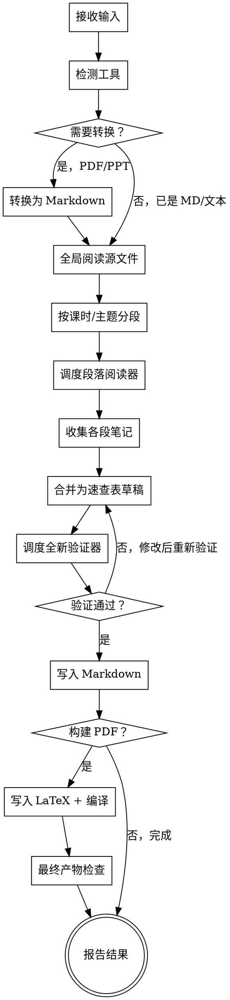

# 课件总结

将课件/讲义转换为简洁的考试导向速查表，包含准确的页码引用、中英双语术语，以及仅保留对理解有实质帮助的图表。

**核心原则：** 将课件总结视为长文档的控制器工作流——先全局阅读，按课时或主题分段，为每段调度专注的阅读器，合并为速查表草稿，然后运行全新的覆盖率检查器，最后生成最终产物。

## 不可妥协的规则

- **默认输出 Markdown。** PDF 输出为可选项，需要 LaTeX 环境（如 TeXWorks）。
- 当此 skill 适用时，仅在聊天中回复或内联摘要**不**算成功的最终交付物，除非用户明确要求仅输出摘要或明确放弃文件创建。
- 如果用户提供的是解析文本、OCR 文字、提取的图片或逐页内容（来源于课件 PDF），而非原始 PDF 文件，仍视为相同的课件总结任务，默认产出文档产物。
- 默认将所有生成的产物放在与源文件相同的目录中。除非用户明确要求，否则不创建子文件夹。
- 默认写作风格以中文为主。
- 重要技术概念、术语和命名分布/定理必须在括号中附上原始英文。
- 每个总结要点默认应附上源课件的页码或简短页码范围，**并格式化为指向源文件的可点击 Markdown 链接**。仅在明确报告提取失败时才可省略引用。
- 输出风格为 `速查表`，体现在覆盖全面、简洁明了、便于快速查阅。**不**意味着强制超密集排版、自动双栏格式或不可读的压缩。
- 默认排版为普通单栏阅读，除非用户明确要求其他排版方式。
- 当用户要求考点时，不要生成泛泛的章节总结。
- 在重要的地方包含公式、关键概念、代表性例题和解题技巧。
- 不要因为上下文或时间压力而悄悄跳过长文档的后续章节。
- 如果提取质量差到无法保留公式、符号或页码映射，应停止并询问，而不是转述不确定的数学内容。
- 如果某个重要概念确实需要图表才能解释清楚，在最终文档中包含它。

## Skill 边界

- 当平台支持时，仍可使用任务或子代理机制，但这是执行细节，**不**构成加载其他 skill 的理由。

## 必须达成的结果

此 skill 默认的成功结果为：

- 保存一个名为 `Summary - <stem>.md` 的 Markdown 文件，放在与源文件相同的目录中
- （可选）如果用户请求 PDF 输出，生成名为 `Summary - <stem>.tex` 的 LaTeX 源文件，放在同一目录
- （可选）如果用户请求 PDF 输出且 LaTeX 环境可用，生成名为 `Summary - <stem>.pdf` 的编译后 PDF 文件，放在同一目录
- 所有生成的文件直接放在与源文件相同的目录中，不创建子文件夹，除非用户明确请求其他位置
- 最终回复报告产物路径和遇到的任何阻碍

如果没有原始文件路径，输入仅为源文件衍生的文本、OCR、提取图片或逐页内容：

- 如果存在用户提供的讲座名称，以其作为命名基础
- 否则使用后备名称 `lecture-slides`
- 默认输出为当前工作目录下直接生成文件，不创建子文件夹，除非用户指定了其他位置

以下**不**算成功完成（除非用户明确请求）：

- 仅在聊天中的内联摘要
- 从未写入磁盘的摘要草稿
- 停留在分析、分段或合并笔记阶段

## 何时使用

当用户希望从课件、讲义 PDF、课堂笔记中获得以下任何内容时，使用此 skill：

- 学习资料
- 速查表 / cheat sheet
- 重点总结
- 公式表
- 简洁的复习文档
- 从课件中提取考点
- 总结这个课件
- 把这个课件整理成复习资料
- 提炼这份 slides 的考点
- 做一个公式和概念速查表
- 做成考试前看的 cheat sheet
- 总结 lecture PDF
- 总结 slides
- 提炼课程讲义里的重点

常见触发词和短语：

- 课件
- slides
- lecture PDF
- 复习资料
- 考点总结
- 总结一下这个课件
- 提炼考点
- 公式速查表
- 概念速查表
- cheat sheet
- 考前整理
- 考试重点

类似 `总结一下这个课件` 的请求仍默认进入上述产出文件的工作流。不要将其重新解释为仅在聊天中回答的许可。

不要将此 skill 用于：

- 作业解答
- 论文写作
- 不需要查找课件页码的文章摘要

## 输入格式

**推荐：Markdown (.md)**
- 最可靠的解析，无 OCR 错误
- 公式以 LaTeX 语法保留
- 用户可使用 Marker、Markitdown 或 Surya 等工具预先转换
- 如果用户提供 Markdown，直接跳到分段步骤

**支持：PDF (.pdf)**
- 可直接阅读，但识别可能有误
- 公式/图表可能丢失或误识别
- 对于扫描版 PDF，建议用户预先转换为 Markdown 以获得更好的质量
- 如果 PDF 读取失败，请用户提供提取文本或 Markdown

**支持：纯文本**
- 用户提供已提取的文本内容
- 视为相同工作流，跳过提取步骤

## 可移植性

- 这是一个独立 skill，无外部 skill 依赖。
- 如果子代理可用且实用，优先将其用于段落阅读器和独立的验证器。对于非常长的课件，当平台可靠支持时，这是首选执行路径。
- 如果子代理不可用，按顺序模拟相同的角色：控制器、逐段阅读、合并、验证。

## 工作流模型

- `控制器` 负责接收、全局阅读、分段、合并、样式规范化、构建选择和最终报告
- 每个 `段落阅读器` 仅负责一个课时块或主题块
- 一个全新的 `验证器` 在合并后检查覆盖率、页码引用、中英双语术语和考试实用性
- 控制器永远不要将段落笔记视为已可信的最终输出

## 调度规则

本节替代任何单独的并行调度 skill 的需要。

- 仅当各段可以在没有共享推理状态的情况下被理解时，才为每个独立课时段使用一个阅读器。
- 良好的分段示例：章节块、明确的标题段落、或长的独立页码范围。
- 不要将紧密耦合的推导过程、跨多页的证明链、或步骤高度依赖的例题拆分到不同段。
- 当多个段落相互独立时，如果平台支持并行子代理，可并行调度。
- 当段落不独立时，即使有并行执行能力也要顺序处理。
- 验证器必须是全新的一轮、全新的上下文。不要复用某个段落阅读器作为验证器。
- 每个调度的阅读器只能接收自己的页码范围、固定的返回格式和不写最终文档的指令。
- 所有阅读器返回后，控制器必须审查冲突、合并，然后将合并草稿交给独立的验证轮次。

## 参考资源

- **示例输出**：[references/example-output.md](references/example-output.md) - 完整的课件总结示例，展示期望输出结构
- **LaTeX 排版规范**：[references/latex-style-guide.md](references/latex-style-guide.md) - 排版标准、常见问题解决、代码规范

遇到排版问题时，优先查阅 `references/latex-style-guide.md`。

## 执行流程



## 步骤 1. 接收输入

- 确认源文件路径（PDF、Markdown 或纯文本）。
- 如果用户已指定输出目录，确认之。
- 确定期望输出：`.md`（默认），`.tex` + `.pdf`（可选）。
- 确定用户需要整份课件还是部分。默认为整份。
- 记录用户已提供的任何样式指令。

除非用户另有说明，默认样式为：

- 语言：中文
- 排版：单栏正常阅读
- 用途：考试复习
- 语气：简洁、清晰、不啰嗦
- 输出：`Summary - <stem>.md`（默认）

## 步骤 1.5. 工具检测与工作流规划

**在阅读源文件之前，检测可用工具并规划最优工作流。**

### 检测清单

检查以下哪些工具可用（跳过读取工具）：

| 工具 | 检测方法 | 用途 |
|------|----------|------|
| **Marker** | `marker_single --help` 或 `where.exe marker` 或 `where marker` | PDF → Markdown（最佳质量，较慢） |
| **Markitdown** | `markitdown --version` 或 `where.exe markitdown` 或 `where markitdown` | 多格式 → Markdown（快速） |
| **Surya** | `surya --version` 或 `where.exe surya` 或 `where surya` | 通用 OCR |
| **Pandoc** | `pandoc --version` 或 `where.exe pandoc` 或 `where pandoc` | PPT/Word → Markdown |
| **LaTeX** | `xelatex --version` 或 `where.exe xelatex` 或 `where xelatex` | PDF 编译 |

### 工作流决策矩阵

根据检测到的工具和输入格式：

| 输入格式 | 可用工具 | 工作流 |
|----------|----------|--------|
| **Markdown** | （任意） | 直接读取 → 处理 → 输出 .md |
| **PDF** | Marker | Marker → Markdown → 处理 → 输出 .md（最佳质量） |
| **PDF** | Markitdown | Markitdown → Markdown → 处理 → 输出 .md（快速） |
| **PDF** | Surya | Surya OCR → Markdown → 处理 → 输出 .md |
| **PDF** | 无 | 直接读取（可能有误）→ 处理 → 输出 .md |
| **PDF** | LaTeX + 用户需要 PDF | 处理 → 输出 .md + .tex + .pdf |
| **PPT** | Pandoc | Pandoc → Markdown → 处理 → 输出 .md |
| **PPT** | Markitdown | Markitdown → Markdown → 处理 → 输出 .md |
| **PPT** | 无 | 请用户手动转换 |
| **纯文本** | （任意） | 直接读取 → 处理 → 输出 .md |

### 决策逻辑

```
1. 检测可用工具
2. 如果输入是 Markdown 或纯文本：
   → 跳过工具检测，直接进入步骤 2
3. 如果输入是 PDF：
   a. 如果 Marker 可用 → 使用 Marker 转换（最佳质量，较慢）
   b. 否则如果 Markitdown 可用 → 使用 Markitdown 转换（快速，质量好）
   c. 否则如果 Surya 可用 → 使用 Surya 进行 OCR
   d. 否则 → 直接读取 PDF（警告用户可能有误）
4. 如果输入是 PPT：
   a. 如果 Pandoc 可用 → 使用 Pandoc 转换为 Markdown
   b. 否则如果 Markitdown 可用 → 使用 Markitdown 转换
   c. 否则 → 请用户手动转换为 Markdown
5. 如果用户需要 PDF 输出：
   a. 如果 LaTeX 可用 → 继续生成 PDF
   b. 否则 → 报告 LaTeX 不可用，询问用户如何处理
```

### 向用户报告

检测完成后，向用户报告：

```
工具检测结果：
- ✅ Marker：可用，将用于 PDF → Markdown 转换
- ✅ LaTeX：可用，支持 PDF 输出
- ❌ Pandoc：不可用，PPT 需手动转换

推荐工作流：PDF → Marker → Markdown → 总结 → 输出 .md（可选：LaTeX → .pdf）
```

**🔴 检查点 · 工具检测完成后确认工作流**
如果缺少关键工具：
1. 报告哪些可用、哪些缺失
2. 说明对输出质量的影响
3. 请用户确认工作流后再继续

## 步骤 2. 先全局阅读源文件

不要直接跳到分块摘要。

**阅读方式：**
- Markdown：直接阅读，结构已清晰
- PDF：使用 Read 工具的 `pages` 参数（如 `pages: "1-5"`）
- 长文档：分批阅读（每次最多 20 页），逐步建立全局理解
- 如果读取失败，请用户提供提取文本或 Markdown

- 如果在此步骤中将提取文本、OCR 输出或保存的笔记写入磁盘，必须写入源文件所在目录中，与其他产物放在一起。
- 阅读足够多的内容以理解文档的宏观结构。
- 识别标题页、目录页、课时分隔、主题过渡和总结幻灯片。
- 在深入阅读之前建立分段地图。

对于非常长的课件，分段加逐段阅读是强制的。不要一次性总结几百页的课件。

对于长课件，控制器必须首先产出：

- 总体主题列表
- 按页码范围的段落边界
- 预期的课时/主题段落数
- 疑似公式密集或概念密集的区域
- 覆盖全部页码范围的分段地图

## 步骤 3. 课件分段

使用最粗粒度的分段，同时保持主题完整性。

优先级依次为：

1. 课件中已有的课时边界
2. 明确的标题边界
3. 主要概念过渡

除非必要，不要将紧密耦合的推导过程拆分到多个段落阅读器。

如果从课时标题或主题幻灯片无法明显看出段落边界，记录该分段的简短理由。

## 步骤 4. 段落阅读器阶段

如果子代理可用且实用，为每个独立段落调度一个全新的 `段落阅读器`。

如果子代理不可用，控制器仍必须在写入任何合并摘要之前创建单独的逐段笔记。不要用一次融合的通读来阅读和总结整份课件。

如果提议的段落不够独立，无法安全地并行阅读，保持相同的逐段结构但顺序执行。

每个段落阅读器应恰好返回以下部分：

- `段落 ID`
- `覆盖的页码范围` — **必须同时包含两个维度**：
  - **原始页码**：原课件的幻灯片/页码（如 `物理页码 pp. 1468-1534`）
  - **源文件行号**：对应内容在 `.md` 源文件中的实际行号（如 `行号 L256-L420`），来自 Read 工具返回的行号
- `主要考点` — 每个考点后附 `(源文件.md#L<起始行>)` 格式的行号
- `核心公式` — 每个公式后附行号
- `附英文的关键概念` — 每个概念后附行号
- `重要例题或常见题型` — 附行号
- `解题技巧或易错点` — 附行号
- `图表候选（如有）`
- `覆盖疑虑或不确定性`

段落阅读器不允许：

- 写最终文档
- 决定最终排版
- 随意跳过页码引用或行号
- 返回不含行号的引用（纯文本 `pp. X` 是不够的）
- 将工作压缩为泛泛的散文式摘要

## 步骤 5. 合并为速查表草稿

控制器将所有段落笔记合并为一个连贯的考试复习结构。

目标输出不是逐页叙述。应按课时或主题块组织，每个块下用简洁的要点列出。

每个主要块应尽量包含：

- 需要知道什么
- 公式
- 为什么重要或何时在题目中出现
- 一个代表性例题模式（如有用）
- 一个实用解题提示（如有用）

## 草稿样式规则

- 中文正文。
- 重要术语在中文术语后立即用括号附上英文。
- 简短要点，不要大段解释性段落。
- 偏好考试用语，如 `定义`、`公式`、`判据`、`技巧`、`典型例题`、`易错点`。
- 避免填充性过渡词和课堂讲故事式的表述。
- 除非定义必须精确，避免逐字复制幻灯片原文。
- 如果某个要点对速查表来说太详细，压缩到回忆方法所需的最少内容。
- 如果压缩到失去意义，略微展开而不是强行追求密度。

## 页码引用规则（必须生成可点击、能跳转到精确行的链接）

**每个页码引用必须是一个可点击的 Markdown 链接，且必须跳转到源文件中该知识点起始行的精确位置。** 仅跳转到文件开头是不够的——用户点击链接后应直接定位到对应内容。

由于生成的总结文件与源文件在同一目录下，使用相对路径仅写源文件名即可。

---

### 链接格式（按源文件类型）

#### 类型 A：Markdown 源文件（`.md`）— 行号锚点（默认）

**单行/单页知识点** —— 跳转到精确行号：
```markdown
[pp. 1468](源文件名.md#L1468)
```

**跨页/跨行知识点** —— 跳转到起始行，行范围用 `-L` 连缀：
```markdown
[pp. 1468-1534](源文件名.md#L1468-L1534)
```

**如果知识点跨越连续的多页，但在源 `.md` 中分布在非连续的行号区间**（如第 3 章介绍内容在第 100 行，例题在第 500 行）：
- 主链接指向主要定义/概念所在行号
- 辅助内容（如例题）单独挂链接到对应的行号
- 不要为了凑成单个链接而捏造一个不存在的 "平均行号"

**行号如何确定**：
- 在步骤 2（全局阅读）和步骤 4（段落阅读）中，用 Read 工具读取源文件时，工具返回的每一行都带有行号前缀（如 `  1468	| 内容...`）
- **必须记录每个知识点/概念在源文件中首次出现时的实际行号**
- 段落阅读器返回的 `覆盖的页码范围` 中，必须同时包含原始页码和对应的源文件行号
- 行号 ≠ 页码：页码是原课件的幻灯片编号，行号是 `.md` 文件中的物理行号。两者都需要记录，但链接锚点使用行号

#### 类型 B：PDF 源文件（`.pdf`）— 页锚点

```markdown
[pp. 1468-1534](源文件名.pdf#page=1468)
```

仅当源文件是 PDF 且未经转换时才使用此格式。一旦 PDF 已被转为 `.md`，使用类型 A。

---

### 强制检查清单（链接质量关卡）

在写入最终文件前，逐一检查以下项目。**任何一条不通过 = 阻断发布：**

- [ ] **每个页码引用都是可点击的 Markdown 链接** — `[pp. X](file#L<num>)`，不是纯文本 `pp. X`
- [ ] **每个链接都包含行号锚点 `#L<数字>`**（`.md` 源文件）或页锚点 `#page=<数字>`（`.pdf` 源文件）— 不允许只链到文件本身
- [ ] **行号锚点指向该知识点在源文件中首次出现的精确行号** — 不允许凭感觉估算，必须来自 Read 工具实际返回的行号
- [ ] **行号范围格式正确** — 区间用 `#L<start>-L<end>`（GitHub 兼容），单行用 `#L<num>`
- [ ] **源文件名正确** — 使用 `源文件名.md` 或 `源文件名.pdf`，与实际文件名完全一致（含大小写、中文）
- [ ] **表格中的页码列同样使用链接格式** — 不因排版原因在表格中省略链接
- [ ] **在最终回复中抽样展示 2-3 个链接并验证可点击性**

---

### 常见错误（红线）

| 错误示例 | 问题 | 正确写法 |
|----------|------|----------|
| `pp. 1468-1534` | 纯文本，无法点击，无法跳转 | `[pp. 1468-1534](源文件.md#L1468-L1534)` |
| `[pp. 1468-1534](源文件.md)` | 可点击但只跳到文件开头，用户需手动翻找 | `[pp. 1468-1534](源文件.md#L1468-L1534)` |
| `[pp. 1468-1534](源文件.md#L1468)` | 只有起始行，范围信息丢失（跨页知识点） | `[pp. 1468-1534](源文件.md#L1468-L1534)` |
| `[pp. 1468](源文件.md#L大约1468)` | 行号前有文字杂质，链接无效 | `[pp. 1468](源文件.md#L1468)` |
| `[pp. 1468](源文件.md#1468)` | 缺少 `L` 前缀，大多数渲染器不识别 | `[pp. 1468](源文件.md#L1468)` |

---

### 页码引用的一般规则

- 默认为每个总结要点附上源页码引用，且格式化为可点击链接（含行号锚点）。
- 优先使用精确页码和精确行号，而非模糊的页码范围。
- 仅当一个概念确实跨越几张相邻幻灯片时才使用页码范围，此时行号范围必须匹配。
- 不要为了省力而降级为仅链到文件级别或宽泛的章节级范围。
- 如果因为提取模糊导致页码或行号映射不确定，明确说明并在最终定稿前解决。仅在明确报告提取失败时才可接受缺失引用。
- **在 Markdown 表格中使用链接**：表格单元格中直接用 `[pp. X-Y](源文件.ext#L<num>)` 格式，不要省略链接，不要因为表格宽度而截断行号。

## 图表规则

仅包含对理解有实质帮助的图表。

好的使用场景：

- 变换域几何或 ROC 示意图
- 零极点图
- 电路或框图等效图
- 时序或信号移位图
- 能实质性减少歧义的简化概念推导示意图

不要添加装饰性图表。

需要图表时：

- Markdown 输出：使用 Mermaid 语法或在文本中描述图表
- LaTeX 输出：使用 `tikz`、`pgfplots` 或类似可复现工具绘制
- 将图表简化到概念最低限度
- 确保它支持周围文本中的某个具体要点

如果无法从源文件中自信地重建一个重要图表，停止并询问，而不是编造图表。

## 验证器阶段

草稿合并后，运行全新的验证器轮次。

如果子代理可用且实用，使用独立的全新 `验证器` 子代理。不要复用阅读器子代理作为验证器。

验证器必须检查以下所有内容：

- 所有主要课时/主题段落均有体现
- 没有明显跳过任何课时块
- 公式密集的章节没有遗漏公式
- 关键概念名称在适当处包含英文
- 要点包含页码引用，且页码已格式化为指向源文件的可点击 Markdown 链接（`[pp. X-Y](源文件名.ext)`）
- **每个链接包含行号锚点**（`.md` 源文件用 `#L<num>` 或 `#L<start>-L<end>`，`.pdf` 源文件用 `#page=<num>`）— 不允许只链到文件级别
- 行号锚点与实际源文件行号匹配（验证器必须抽查 3-5 个链接，打开源文件对照行号）
- 风格简洁且面向考试，而非泛泛的摘要散文
- 在重要的地方包含代表性例题或解题模式
- 任何包含的图表在概念上合理
- 任何明显需要的图表没有遗漏
- 输出仍然可读，没有为追求密度而过度压缩
- 抽样检查中引用的页码或页码范围与总结的概念或公式匹配
- 分段地图中的每个段落在最终草稿中均有体现，或明确说明有意省略

验证器必须恰好返回以下部分：

- `裁决`，为以下之一：`通过`、`通过但有备注`、`不通过`
- `覆盖率发现`
- `样式和忠实度发现`
- `缺失或薄弱区域`

如果验证器报告缺失覆盖、页码引用薄弱、英文标签缺失、高价值例题缺失或源内容漂移问题，修复草稿并重新运行验证。

验证器不得在未进行直接源文件核查的情况下批准带页码引用的输出。

## 草稿关卡

**🛑 STOP · 必须满足所有条件才能继续**

在进入最终输出之前，必须满足：

- [ ] 所有预期段落均已处理
- [ ] 合并草稿已存在
- [ ] 页码引用对总结要点存在且连贯，并已格式化为指向源文件的可点击 Markdown 链接，**且每个链接包含行号锚点（`#L<num>`）或页锚点（`#page=<num>`）**，除非有明确的提取失败记录
- [ ] 中英双语术语已就位
- [ ] 验证器裁决为 `通过`

如果验证器返回 `通过但有备注`，解决备注并运行全新的验证器轮次。不要在过期的验证器裁决上进入最终输出。

不要在草稿阶段声称任务完成。草稿完成不等于文档完成。

## 步骤 6. 写入 Markdown 输出

**默认输出格式：Markdown**

- 将合并草稿写入 `Summary - <stem>.md`
- 使用标准 Markdown 语法处理标题、列表、代码块和数学公式
- 数学公式：行内用 `$...$`，独立公式用 `$$...$$`
- 表格：使用标准 Markdown 表格语法
- 图表：使用 Mermaid 语法或描述性文本
- **页码引用：必须格式化为可点击链接，含精确行号锚点**。格式：`[pp. X-Y](源文件名.ext#L<起始行>)` 或跨行用 `[pp. X-Y](源文件名.ext#L<起始>-L<结束>)`。由于总结文件与源文件同目录，无需路径前缀，直接写源文件名即可。**行号来自 Read 工具实际返回的行号，不可估算。**

**Markdown 结构：**

```markdown
# 课程名 · 章节名

## 核心概念

### 概念名称 [pp. 1468-1534](源文件名.md#L256-L420)

**定义**：... [pp. 1468](源文件名.md#L256)

**公式**：
$$公式$$
*来源：[pp. 1470](源文件名.md#L280)*

**物理意义**：...

**典型例题**：... [pp. 1500-1505](源文件名.md#L350-L385)

**易错点**：
- ... [pp. 1520](源文件名.md#L400)

---

## 重要性质

1. ... [pp. 1602](源文件名.md#L450)
2. ...

---

## 考试重点

| 优先级 | 知识点 | 页码（点击跳转到源文件对应行） |
|--------|--------|------|
| 🔴 **必考** | CPU 时间公式及综合计算 | [pp. 1468-1534](源文件名.md#L256-L420) |
| ⚡ **重点** | CPI 的含义、影响因素、优化方向 | [pp. 1476-1518](源文件名.md#L435-L510) |
| 📌 **理解** | 指令执行周期 | [pp. 754-782](源文件名.md#L180-L245) |

> 上表中 `pp.` 对应原课件页码，`#L数字` 对应源 `.md` 文件中的精确行号。点击链接直接跳转到该知识点在源文件中的起始行。
```

## 步骤 7. PDF 输出（可选）

**PDF 输出为可选。** 仅在以下情况下继续：
- 用户明确请求 PDF 输出，且
- LaTeX 环境可用（TeXWorks、TeXLive、MiKTeX 等）

**如果用户需要 PDF 但没有 LaTeX 环境：**
1. 报告 PDF 输出需要 LaTeX 环境
2. 建议用户安装 TeXWorks 或其他 LaTeX 发行版
3. 不要悄悄跳过 PDF——询问用户如何处理

**如果 LaTeX 环境可用：**

- 将 LaTeX 源码写入 `Summary - <stem>.tex`
- **LaTeX 页码引用**：使用 `\href{源文件名.pdf\#page=1468}{pp. 1468-1534}` 生成可点击的页码链接（需要 `\usepackage{hyperref}`），或使用 `\hyperref[pp. 1468-1534]{源文件名.ext}` 格式
- 使用可用的 LaTeX 工具编译（TeXWorks、xelatex 等）
- 确认 `.tex` 和 `.pdf` 都已生成
- 将任何 LaTeX 致命错误或非零退出状态视为构建失败

**🔴 检查点 · 构建失败必须报告**
如果 LaTeX 编译失败：
1. 向用户报告错误
2. 不要悄悄降级为仅 Markdown
3. 等待用户决定

## 最终回复策略

- 不要用最终回复来替代缺失的产物。
- 除非文件确实已创建并检查，否则不要说工作已完成。
- 如果因缺少 LaTeX 环境、提取质量差或其他硬性前提条件而受阻，明确说明并停止，而不是悄悄降级为聊天输出。
- 完成后，最终回复应首先指向生成的产物路径，然后简要总结产出了什么。

## 输出命名

使用基于源文件名的确定性命名：

- Markdown 输出：`Summary - <stem>.md`，直接放在与源文件相同的目录中
- LaTeX 源码（可选）：`Summary - <stem>.tex`，放在同一目录
- 最终 PDF（可选）：`Summary - <stem>.pdf`，放在同一目录
- 任何辅助或中间生成的文件：放在同一目录中，命名为从 `<stem>` 派生的名称，而非 `output.*` 或 `temp.*` 等通用名称
- 不创建额外的子文件夹，除非用户明确要求

如果用户指定了自定义输出路径或文件名，遵循用户的指定。

如果不存在源文件路径，应用 `必须达成的结果` 中的后备命名规则，而不是临时发明新的命名方案。

## 常见失败模式

- 一次性总结整份文档而不分段
- 页码引用为纯文本而非可点击链接（应与源文件在同一目录，用 `[pp. X](源文件名.ext#L<行号>)` 格式，必须含行号锚点）
- 生成泛泛的章节总结而非考点
- 在 skill 已触发且未明确放弃文件输出的情况下，仅以聊天摘要回复
- 创建不必要的子文件夹（除非用户明确要求）
- 调用其他 skill，即使此工作流是自包含的
- 因为添加英文术语太晚而遗漏
- 因为 `速查表` 这个词被逐字理解而过度压缩排版
- 即使概念明显受益于图表也跳过
- 只保留最终公式而丢弃例题模式或解题技巧
- 在分块摘要后停止，没有全局综合轮次
- 在起草后停止，没有写入最终文件
- 没有实际创建产物就声称完成

## 合理化借口表

| 借口 | 现实 |
|------|------|
| "我可以一次性总结整份文档" | 长课件需要先分段，否则覆盖会偏移。 |
| "章节级页码范围够用了" | 此任务用于查阅，要点级页码引用很重要。 |
| "纯文本页码就够了，用户自己会去找" | 页码引用必须是可点击链接才能发挥快速定位的价值。生成的总结与源文件同目录，加链接零成本。 |
| "链接到文件就够了，用户自己滚动到对应行" | 链接必须带行号锚点 `#L<num>`。只链到文件让用户浪费大量时间翻找一个几百行的文件。行号来自 Read 工具返回值，零额外成本。 |
| "英文术语不言自明" | 双语标签是核心交付物，不是可选的润色。 |
| "速查表意味着密集的双栏填鸭格式" | 这里指简洁高效，不是不可读的压缩。 |
| "文字就够了，可以跳过图表" | 某些概念有简单图表会更清晰。 |
| "最终公式就够了" | 备考通常依赖例题模式和解题技巧。 |
| "用户只说了 `总结一下这个课件`，聊天摘要就够了" | 当此 skill 触发时，总结意味着产出文档产物，除非用户明确放弃。 |
| "我已经在脑中构思好草稿了，可以报告完成" | 脑中的或未写下的草稿不是交付物。文件必须实际存在。 |
| "应该创建子文件夹来组织文件" | 除非用户明确要求，否则直接将文件放在源文件同目录，不创建子文件夹。 |
| "PDF 总是必需的" | Markdown 是默认的。PDF 是可选的且需要 LaTeX。 |

## 红旗警告

- 对非常长的文档一次性摘要
- 没有分段地图
- 要点中没有页码引用，或页码引用是纯文本而非可点击链接
- 页码链接只到文件级别（如 `(源文件.md)`），缺少行号锚点（应为 `(源文件.md#L256)`）
- 行号锚点是用估算值而非 Read 工具实际返回的行号
- 核心概念没有英文术语
- 泛泛的散文式摘要而非考点
- 输出文件存在之前就给出最终答案
- 基于计划步骤而非已执行步骤声称完成
- 创建不必要的子文件夹（除非用户明确要求）
- 合并后没有验证器轮次
- 尽管概念明显需要但仍省略图表
- 以 `速查表` 为由使用不可读的压缩格式

以上所有情况意味着：停止、修复工作流，并在最终定稿前重新运行验证。

## 反例清单（不要做的事）

| # | 反模式 | 为什么不要做 | 正确做法 |
|---|--------|-------------|----------|
| 1 | **一次性总结整个长文档** | 长文档需要分段处理，否则覆盖不全 | 先分段，再逐段阅读，最后合并 |
| 2 | **省略页码引用** | 用户需要快速定位原文 | 每个知识点标注页码或页码范围，格式化为 `[pp. X-Y](源文件.ext#L<行号>)` 带行号锚点的可点击链接 |
| 2b | **页码引用是纯文本而非可点击链接** | 用户无法直接跳转到原文，失去页码引用的核心价值 | 始终使用 `[pp. X-Y](源文件名.ext)` 格式，页引用必须是可点击的 |
| 2c | **页码链接只到文件级别，缺少行号锚点** | 点击后跳到文件开头，用户需在几百行文件中手动翻找 | 必须带 `#L<num>`（单行）或 `#L<start>-L<end>`（跨行）锚点，行号来自 Read 工具返回的实际值 |
| 3 | **只写中文不写英文** | 双语术语是核心交付物 | 重要术语后附英文括号 |
| 4 | **创建不必要的子文件夹** | 违背用户预期，文件应直接在源文件同目录 | 除非用户明确要求，否则不创建子文件夹 |
| 5 | **跳过验证步骤** | 可能遗漏重要内容 | 必须运行验证器检查覆盖率和准确性 |
| 6 | **编造不确定的数学公式** | 可能出错误导用户 | 提取质量差时停止并询问用户 |
| 7 | **强制要求 PDF 输出** | 很多用户没有 LaTeX 环境 | 默认 Markdown，PDF 可选 |
| 8 | **跳过 Markdown 直接写 LaTeX** | Markdown 更通用，便于编辑 | 先写 Markdown，需要时再转 LaTeX |
